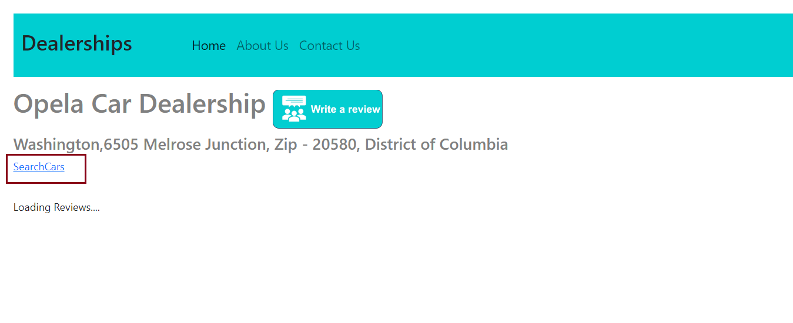
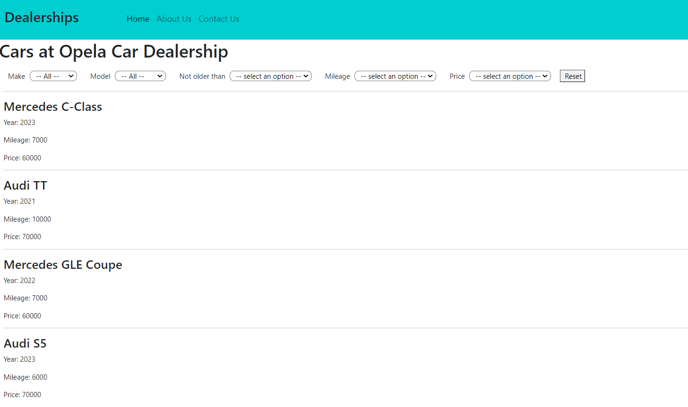

::page{title="Hands on lab: Enhance your app - Part 3: Front-end development and testing of your app"}


## Estimated time needed: 45 minutes

In this lab, your objective is to construct and integrate the front-end that corresponds to the back-end enhancement implemented in Part 2. Following this, you'll be evaluating the output of your improved Django application.

## Objectives

In this lab, you will:
- Develop and integrate the front-end corresponding to the back-end cars inventory microservice (created in Part 2).
- Test the output of your Django application with the integrated cars inventory service.

## Prerequisites:

1. You must have completed <a href="https://github.com/Sklup55/Parts1-2-3-Fs_Appl_Dev_Cpstn/blob/master/Part01.md"> Hands on lab: Enhance your app - Part 1: Front-end </a> .

2. 1. You must have completed <a href="https://github.com/Sklup55/Parts1-2-3-Fs_Appl_Dev_Cpstn/blob/master/Part02.md">  Hands on lab: Enhance your app - Part 2: Back-end </a> .

2. Sentiment Analyzer service on IBM Cloud Code Engine should be deployed and accessible. Please refer to the section `Deploy sentiment analysis on Code Engine as a microservice` in the lab [Create Django Proxy Services Of Backend APIs](https://cf-courses-data.s3.us.cloud-object-storage.appdomain.cloud/IBMSkillsNetwork-CD0321EN-Coursera/labs/v2/m3/DjangoProxy.md.html) for the same.

3. Backend service with Express-MongoDB should be running on one of the terminals. Please refer to the lab [Implement API endpoints using Express-Mongo](https://cf-courses-data.s3.us.cloud-object-storage.appdomain.cloud/IBMSkillsNetwork-CD0321EN-Coursera/labs/v2/m3/BackendServices_Mongo.md.html) for the same.

4. The front-end of the application should be already built. Please refer to the section `Build the client-side and configure it` in the lab [User Management](https://cf-courses-data.s3.us.cloud-object-storage.appdomain.cloud/IBMSkillsNetwork-CD0321EN-Coursera/labs/v2/m2/UserManagement.md.html) for the same.

5. The Django (main application) server should be running. Please refer to the section `Environment setup` in the lab [Build CarModel and CarMake Django Models](https://cf-courses-data.s3.us.cloud-object-storage.appdomain.cloud/IBMSkillsNetwork-CD0321EN-Coursera/labs/v2/m3/BackendServices_Django.md.html) for the same.


::page{title="Develop and integrate the front-end corresponding to the back-end cars inventory microservice"}

This involves creating a React component dedicated to searching and displaying car information, along with incorporating the corresponding route for this component.

#### A. Create a React component for searching and displaying car information

Navigate to the `xrwvm-fullstack_developer_capstone/server/frontend/src/components/Dealers` directory and add a new file named `SearchCars.jsx`.

**Incorporate following functionality into this file.**

1. Declare a functional component named `SearchCars`.

2. Initialize the following state variables:
- `allCars`: To store all fetched cars.
- `cars`: To store the currently displayed cars.
- `makes`: To store unique car makes for filtering.
- `models`: To store unique car models for filtering.
- `dealer`: An object representing the dealer details.
- `message`: To store a loading message or an error message.

3. Extract the \'id\' parameter from the URL and construct URLs for API calls.

4. Create 2 asynchronous functions that fetch details by using the `fetch` API to perform GET requests to the specified URL, parse the JSON response, and set the state.

- `fetchCars`: which extracts and sets the full name of the dealer.
- `fetchCars`: which populates makes and models states

5. A function `populateMakesAndModels` that takes an array of cars as a parameter and populates the makes and models state based on unique values from the cars.

6. This should have an asynchronous function named `setCarsmatchingCriteria` which does the following:

- Copies the array of cars that match the given criteria and logs the number of matching cars.
- Filters the cars based on selected make, model, year, mileage, and price.
- Updates the \'make\' dropdown value if applicable based on the filtered cars.
- Sets a message if no cars match the criteria.
- Updates the state variable \'cars\' with the filtered cars.

7. Create five functions for state management:

- Each of these functions will retrieve a field the dropdown, append the respective parameter to the Dealer URL, perform GET requests to the server with the updated URL to obtain the filtered car data, and update the 'cars' state using the `setCarsmatchingCriteria `function.

1. `SearchCarsByMake:` Will retreive the selected \'make\' value from the dropdown and append the \'make\' parameter to the Dealer URL.
2. `SearchCarsByModel`: Will retrieve the selected \'model\' value from the dropdown and append the \'make\' parameter to the Dealer URL.
3. `SearchCarsByYear`: Will retrieve the selected \'year\' value from the dropdown and append the \'year\' parameter to the Dealer URL.
4. `SearchCarsByMileage`: Will retrieve the selected \'year\' value from the dropdown and append the \'year\' parameter to the Dealer URL.
5. `SearchCarsByPrice`: Will retrieve the selected \'year\' value from the dropdown and append the \'year\' parameter to the Dealer URL.

8. A useEffect hook to call the `fetchCars` and `fetchDealer` functions to initialize the state with data from the server.

9. Create a function named `reset` that resets the selected options in all dropdowns to their defaults and then fetches and displays all cars, providing a way to reset the search criteria to the initial state.

10. The `render` section for displaying the search options (make, model, year, mileage, price) and the list of cars based on the selected criteria.

##### Complete solution:

<details>
	
<summary> Click here for one possible implementation of `SearchCars.jsx`: </summary>

```
import React, { useState, useEffect } from 'react';
import { useParams } from 'react-router-dom';
import Header from '../Header/Header';

const SearchCars = () => {
  const [allCars, setAllCars] = useState([]);
  const [cars, setCars] = useState([]);
  const [makes, setMakes] = useState([]);
  const [models, setModels] = useState([]);
  const [dealer, setDealer] = useState({"full_name":""});
  const [message, setMessage] = useState("Loading Cars....");
  const { id } = useParams();


  let dealer_url = `/djangoapp/get_inventory/${id}`;

  let fetch_url = `/djangoapp/dealer/${id}`;
  
  const fetchDealer = async ()=>{
    const res = await fetch(fetch_url, {
      method: "GET"
    });
    const retobj = await res.json();
    if(retobj.status === 200) {
      let dealer = retobj.dealer;
      setDealer({"full_name":dealer[0].full_name})
    }
  }

  const populateMakesAndModels = (cars)=>{
    let tmpmakes = []
    let tmpmodels = []
    cars.forEach((car)=>{
      tmpmakes.push(car.make)
      tmpmodels.push(car.model)
    })
    setMakes(Array.from(new Set(tmpmakes)));
    setModels(Array.from(new Set(tmpmodels)));
  }
    

  const fetchCars = async ()=>{
    const res = await fetch(dealer_url, {
      method: "GET"
    });
    const retobj = await res.json();
    
    if(retobj.status === 200) {
      let cars = Array.from(retobj.cars)
      setCars(cars);
      setAllCars(cars);
      populateMakesAndModels(cars);
    }
  }

  const setCarsmatchingCriteria = async(matching_cars)=>{
    let cars = Array.from(matching_cars)
    console.log("Number of matching cars "+cars.length);

    let makeIdx = document.getElementById('make').selectedIndex;
    let modelIdx = document.getElementById('model').selectedIndex;
    let yearIdx = document.getElementById('year').selectedIndex;
    let mileageIdx = document.getElementById('mileage').selectedIndex;
    let priceIdx = document.getElementById('price').selectedIndex;

    if(makeIdx !== 0) {
      let currmake = document.getElementById('make').value;
      cars = cars.filter(car => car.make === currmake);
    }
    if(modelIdx !== 0) {
      let currmodel = document.getElementById('model').value;
      cars = cars.filter(car => car.model === currmodel);
      if(cars.length !== 0) {
        document.getElementById('make').value = cars[0].make;
      }
    }

    if(yearIdx !== 0) {
      let curryear = document.getElementById('year').value;
      cars = cars.filter(car => car.year >= curryear);
      if(cars.length !== 0) {
        document.getElementById('make').value = cars[0].make;
      }
    }

    if(mileageIdx !== 0) {
      let currmileage = parseInt(document.getElementById('mileage').value);
      if(currmileage === 50000) {
        cars = cars.filter(car => car.mileage <= currmileage);
      } else if (currmileage === 100000){
        cars = cars.filter(car => car.mileage <= currmileage && car.mileage > 50000);
      } else if (currmileage === 150000){
        cars = cars.filter(car => car.mileage <= currmileage && car.mileage > 100000);
      } else if (currmileage === 200000){
        cars = cars.filter(car => car.mileage <= currmileage && car.mileage > 150000);
      } else {
        cars = cars.filter(car => car.mileage > 200000);
      }
    }

    if(priceIdx !== 0) {
      let currprice = parseInt(document.getElementById('price').value);
      if(currprice === 20000) {
        cars = cars.filter(car => car.price <= currprice);
      } else if (currprice === 40000){
        cars = cars.filter(car => car.price <= currprice && car.price > 20000);
      } else if (currprice === 60000){
        cars = cars.filter(car => car.price <= currprice && car.price > 40000);
      } else if (currprice === 80000){
        cars = cars.filter(car => car.price <= currprice && car.price > 60000);
      } else {
        cars = cars.filter(car => car.price > 80000);
      }
    }

    if(cars.length === 0) {
      setMessage("No cars found matching criteria");
    }
    setCars(cars);
  }
  let SearchCarsByMake = async ()=> {
    let make = document.getElementById("make").value;
    dealer_url = dealer_url + "?make="+make;

    const res = await fetch(dealer_url, {
        method: 'GET',
        headers: {
          'Content-Type': 'application/json',
        }})

      const retobj = await res.json();
      
      if(retobj.status === 200) {
        setCarsmatchingCriteria(retobj.cars);
      }
  }

   let SearchCarsByModel = async ()=> {
    let model = document.getElementById("model").value;
    dealer_url = dealer_url + "?model="+model;

    const res = await fetch(dealer_url, {
        method: 'GET',
        headers: {
          'Content-Type': 'application/json',
        }})

      const retobj = await res.json();
      
      if(retobj.status === 200) {
        setCarsmatchingCriteria(retobj.cars);
      }
  }

  let SearchCarsByYear = async ()=> {
    let year = document.getElementById("year").value;
    dealer_url = dealer_url + "?year="+year;

    const res = await fetch(dealer_url, {
        method: 'GET',
        headers: {
          'Content-Type': 'application/json',
        }})

      const retobj = await res.json();
      
      if(retobj.status === 200) {
        setCarsmatchingCriteria(retobj.cars);
      }
  }

  let SearchCarsByMileage = async ()=> {
    
    let mileage = document.getElementById("mileage").value;
    dealer_url = dealer_url + "?mileage="+mileage;

    const res = await fetch(dealer_url, {
        method: 'GET',
        headers: {
          'Content-Type': 'application/json',
        }})

      const retobj = await res.json();
      
      if(retobj.status === 200) {
        setCarsmatchingCriteria(retobj.cars);
      }
  }


  let SearchCarsByPrice = async ()=> {
    let price = document.getElementById("price").value;
    dealer_url = dealer_url + "?price="+price;

    const res = await fetch(dealer_url, {
        method: 'GET',
        headers: {
          'Content-Type': 'application/json',
        }})

      const retobj = await res.json();
      
      if(retobj.status === 200) {
        setCarsmatchingCriteria(retobj.cars);
      }
  }

  const reset = ()=>{
    const selectElements = document.querySelectorAll('select');

    selectElements.forEach((select) => {
      select.selectedIndex = 0;
    });  
    fetchCars();
  }
  

  useEffect(() => {
    fetchCars();
    fetchDealer();
  },[]); 

  return (
    <div>
      <Header />
      <h1 style={{ marginBottom: '20px'}}>Cars at {dealer.full_name}</h1>
      <div>
      <span style={{ marginLeft: '10px', paddingLeft: '10px'}}>Make</span>
      <select style={{ marginLeft: '10px', marginRight: '10px' ,paddingLeft: '10px', borderRadius :'10px'}} name="make" id="make" onChange={SearchCarsByMake}>
        {makes.length === 0 ? (
          <option value=''>No data found</option>
        ):(
          <>
          <option disabled defaultValue> -- All -- </option>
          {makes.map((make, index) => (
            <option key={index} value={make}>
              {make}
            </option>
          ))}
        </>
        )        
        }
      </select>
      <span style={{ marginLeft: '10px', paddingLeft: '10px'}}>Model</span>
      <select style={{ marginLeft: '10px', marginRight: '10px' ,paddingLeft: '10px', borderRadius :'10px'}} name="model" id="model" onChange={SearchCarsByModel}>
      {models.length === 0 ? (
        <option value=''>No data found</option>
      ) : (
        <>
          <option disabled defaultValue> -- All -- </option>
          {models.map((model, index) => (
            <option key={index} value={model}>
              {model}
            </option>
          ))}
        </>
      )}      
      </select>
      <span style={{ marginLeft: '10px', paddingLeft: '10px'}}>Not older than</span>
      <select style={{ marginLeft: '10px', marginRight: '10px' ,paddingLeft: '10px', borderRadius :'10px'}} name="year" id="year" onChange={SearchCarsByYear}>
          <option disabled selected value> -- select an option -- </option>
          <option value='2024'>2024</option>
          <option value='2023'>2023</option>
          <option value='2022'>2022</option>
          <option value='2021'>2021</option>
          <option value='2020'>2020</option>
      </select>
      <span style={{ marginLeft: '10px', paddingLeft: '10px'}}>Mileage</span>
      <select style={{ marginLeft: '10px', marginRight: '10px' ,paddingLeft: '10px', borderRadius :'10px'}} name="mileage" id="mileage" onChange={SearchCarsByMileage}>
          <option disabled selected value> -- select an option -- </option>
          <option value='50000'>Under 50000</option>
          <option value='100000'>50000 - 100000</option>
          <option value='150000'>100000 - 150000</option>
          <option value='200000'>150000 - 200000</option>
          <option value='200001'>Over 200000</option>
      </select>
      <span style={{ marginLeft: '10px', paddingLeft: '10px'}}>Price</span>
      <select style={{ marginLeft: '10px', marginRight: '10px' ,paddingLeft: '10px', borderRadius :'10px'}} name="price" id="price" onChange={SearchCarsByPrice}>
          <option disabled selected value> -- select an option -- </option>
          <option value='20000'>Under 20000</option>
          <option value='40000'>20000 - 40000</option>
          <option value='60000'>40000 - 60000</option>
          <option value='80000'>60000 - 80000</option>
          <option value='80001'>Over 80000</option>
      </select>

      <button style={{marginLeft: '10px', paddingLeft: '10px'}} onClick={reset}>Reset</button>

      </div>


      <div style={{ marginLeft: '10px', marginRight: '10px' , marginTop: '20px'}} >
        {cars.length === 0 ? (
          <p style={{ marginLeft: '10px', marginRight: '10px', marginTop: '20px' }}>{message}</p>
        ) : (
          <div>
            <hr/>
            {cars.map((car) => (
              <div>
              <div key={car._id}>
                <h3>{car.make} {car.model}</h3>
                <p>Year: {car.year}</p>
                <p>Mileage: {car.mileage}</p>
                <p>Price: {car.price}</p>
              </div>
              <hr/>
              </div>
            )
        )}

          </div>
        )}
      </div>
    </div>
  );
};

export default SearchCars;
```

</details>


#### B. Add the route for this component and build the front-end

1. Add the import statement and route for this component in `frontend/src/App.js`, making use of the search path as `/searchcars/:id`.

<details>

<summary>Click to see the solution</summary>

Import statement:
```
import SearchCars from "./components/Dealers/SearchCars";	
```

Route:
```
<Route path="/searchcars/:id" element={<SearchCars />} />
```
</details>

	
2. Integrate an anchor link to redirect users to the `Search Cars` page from the review page for a specific dealer.

- Go to `frontend/src/components/Dealers/Dealer.jsx` and insert an anchor element.
- Label it as Search Cars and set it to navigate to the Search Cars page upon being clicked.

<details>

<summary>Click to see the solution</summary>

```
<a href={`/searchcars/${id}`}>SearchCars</a>	
```

</details>

	
3. Build the frontend of the application for deployment.

<details>

<summary>Click to see the solution</summary>

```
npm run build
```
</details>
	
4. Add a dynamic URL pattern with path `searchcars/<int:dealer_id> ` in `djangoproj/urls.py`.
	
<details>
	
<summary>Click to see the solution</summary>

```
path('searchcars/<int:dealer_id>',TemplateView.as_view(template_name="index.html")),	
```

</details>

**Having completed this, the front-end corresponding to the backend microservice developed in Part 2 has been implemented. You are now ready to proceed with testing the final output of the enhanced Django application in the next section.**

::page{title="Test the output of your Django application with the integrated Cars Inventory service"}

1. Head to the `xrwvm-fullstack_developer_capstone/server` directory.

2. Run migrations and start the Django app server.
	
<details>
	
<summary>Click to see the commands</summary>

```
python3 manage.py makemigrations
python3 manage.py migrate --run-syncdb
python3 manage.py runserver
```
</details>
	
##### Testing the Output of the Django Application

3. Take note of the Dealer Reviews page, where you will find a recently added link titled `SearchCars`.

	<br><br>
	
4. Click `SearchCars` to navigate to the Search Cars page, containing the inventory details of all cars.
	
	<br><br>

5.  If you select the dropdown fields as below, you will observe the car details pertaining to your search criteria.
	
Make: `Audi`
Model: `TT`
Not older than (Year): `2021`
Mileage: `Under 50000`
Price: `60000 - 80000`

	
	
##### With this, you have successfully tested and examined the enhanced functionality and user interface of your application. This concludes the third and final lab for enhancing your application.

		

::page{title="Conclusion"}

Congratulations on completing this lab!
	
In this lab, you seamlessly developed and integrated the front-end component with the back-end cars inventory microservice, as established in Part 2 of enhancing your application.
Subsequently, you thoroughly evaluated the output of your Django application with the incorporated Cars Inventory service.
	
Through this process, you have thoroughly tested and observed the enhanced functionality and user interface resulting from all the procedures undertaken in parts 2 and 3 of enhancing your application.


<br>

## Author(s)
**Lavanya TS**
**K Sundararajan**
<br>

<!-- ## Changelog
| Date | Version | Changed by | Change Description |
|------|--------|--------|---------|
| 25-01-2024 | 0.1 | K Sundararajan | Initial version created |
| 29-01-2024 | 0.2 | Gagandeep | Review and formatting |-->

<h3 align="center"> &#169; IBM Corporation. All rights reserved. <h3/>
